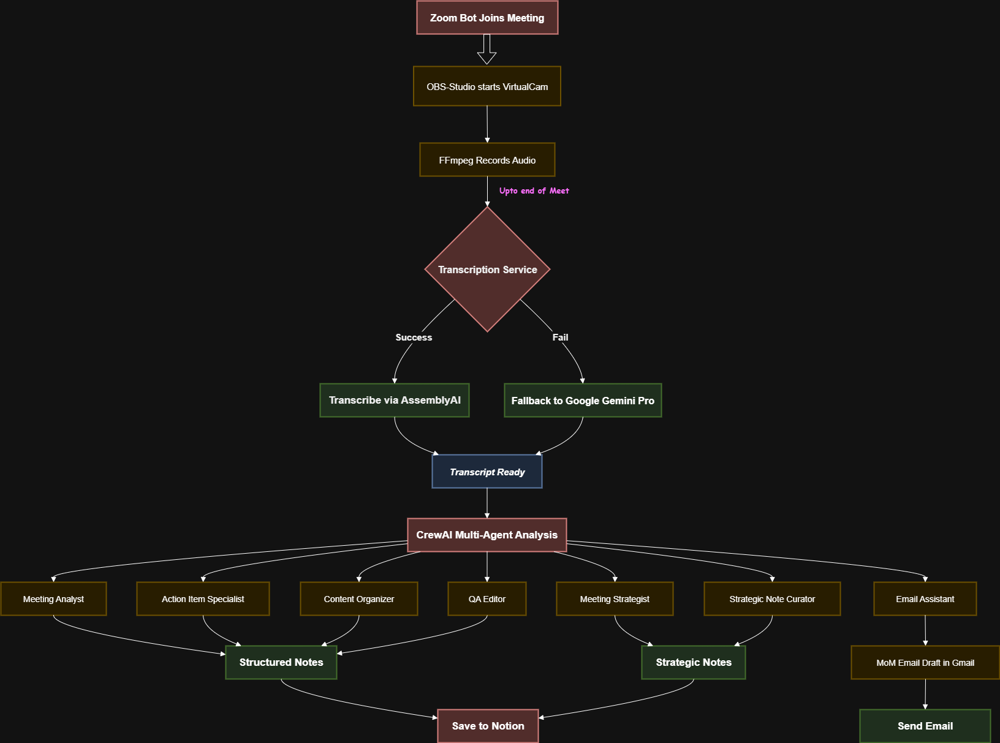
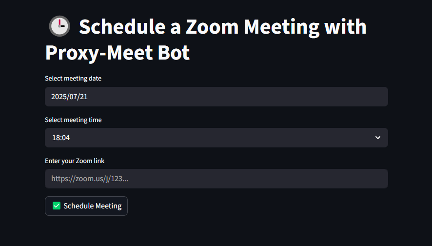

# 🤖📝 PROXY-MEET 📝🤖


Feeling under the weather? Called away for an urgent matter? Don't let unexpected circumstances force you to miss important online meetings. PROXY-MEET seamlessly handles your meeting attendance, ensuring you maintain your commitments even when life gets in the way.

Whether you're dealing with illness, family emergencies, or conflicting priorities, PROXY-MEET provides reliable meeting coverage so you never have to choose between your responsibilities and your well-being.

An intelligent meeting automation system that acts as your proxy in online meetings, providing automated attendance, interacts when your name is called, 
generates structured meeting notes using multiple AI agents and logs it into Notion, and creates professional Minutes of Meeting (MoM) email drafts.


**⚠️ Note:** This application is currently optimized for Windows OS and may not function properly on macOS or Linux.

<div align="center">
  
  <p><em><b>Proxy-Meet Demo: Intelligent Meeting Automation</b></em></p>
</div>


## 🚀 Features

- **Automated Meeting Attendance**: Joins scheduled Zoom meetings automatically
- **Intelligent Interaction**: AI-powered response via voice and in message window when your name is called
- **Meeting Logging**: Automatic audio and transcript logging in `archives/` 
- **Advanced Transcription**: Uses Google Gemini 2.5 Pro for accurate transcription with speaker diarization
- **Dual Note-taking Strategy**: 
  - Predefined structured format
  - AI-recommended format based on meeting type (progress updates, brainstorming, 1-on-1s, interviews, etc.)
- **Automated Email Distribution**: Creates MoM email drafts in Gmail
- **Multi-Agent Analysis**: Uses CrewAI with specialized agents for comprehensive meeting analysis
- **Professional Output**: Generates structured notes in Markdown format
- **Notion Logging**: Automatically logs both the meeting-notes in an organized mannner in Notion 
- **Streamlit Dashboard**: User-friendly web interface 


## 🏛️ Architecture
  
<div align="center">
  
  <p><em>Proxy-Meet Architecture</em></p>
</div>

The application uses a multi-agent system powered by CrewAI:

1. **Meeting Analyst** - Extracts core content and themes
2. **Action Item Specialist** - Identifies actionable tasks
3. **Content Organizer** - Structures information hierarchically
4. **Quality Assurance Editor** - Ensures accuracy and formatting
5. **Meeting Strategist** - Determines optimal documentation framework
6. **Strategic Note Curator** - Applies sophisticated note-taking methodologies
7. **Email Assistant** - Formats and distributes meeting minutes


## 📋 Prerequisites

Before setting up Proxy-Meet, ensure you have:

- Python 3.8 or higher
- OBS Studio 
- ffmpeg
- VB-CABLE (Virtual Audio Device)
- Google Cloud Platform Account
- Google API key (for Gemini AI)
- Notion API key & Database Id
- AssemblyAI API key
- Stable internet connection

## 🛠️ Installation & Setup

### Step 1: Clone the Repository

```bash
git clone https://github.com/YOUR_USERNAME/Proxy-Meet.git
cd Proxy-Meet
```

### Step 2: Create Virtual Environment

```bash
# Create virtual environment
python -m venv venv

# Activate virtual environment
venv\Scripts\activate.bat
```

### Step 3: Install Dependencies

```bash
pip install -r requirements.txt
```

### Step 4: Environment Configuration

Create a `.env` file in the project root:

```env
# Notion APIs
NOTION_API_KEY="your_notion_internal_integration_secret_key"
NOTION_DATABASE_ID="your_notion_database_id"

# Zoom Configuration
ZOOM_LINK="your_zoom_meeting_link"
WAIT_INTERVAL="30"
MAX_WAIT_TIME="3600"

# AI Configuration
GOOGLE_API_KEY=your_google_api_key  
AAI_API_KEY=your_assemblyai_api_key
LANGFUSE_PUBLIC_KEY="your_langfuse_publickey"
LANGFUSE_SECRET_KEY="your_langfuse_secretkey"
LANGFUSE_HOST="https://cloud.langfuse.com"  
```

### Step 5: Personal Avatar Setup

1. Record a short video of yourself (`me.mp4`) for avatar purposes
2. Place it in the project root
3. Ensure good lighting


### Step 6: OBS Studio Setup

#### 6.1 Installation:

1. **Download OBS Studio:**
   - Go to [OBS Studio](https://obsproject.com/)
   - Download the installer for Windows
   - Run the installer and complete the installation (make sure the installation location is in `C:\Program Files\`)

#### 6.2 Configuration:

1. **Scene Setup:**
   - Launch OBS Studio
   - Under **Scenes** panel (bottom left), create one profile:
     - Right-click in Scenes area → Add → Enter scene name → OK

2. **Source Configuration:**
   - Under **Sources** panel (bottom center), add media source:
     - Click the **+** button → Select **Media Source** → Create New → OK
   - **Configure Media Source:**
     - Browse and select your pre-recorded video file
     - Check the following options:
       - ✅ **Loop** 
       - ✅ **Restart playback when source becomes active**
     - Click **OK** to save settings

3. **Verify Setup:**
   ```bash
   # Your video should now be playing in the preview window
   # The video will loop continuously and restart when switching scenes
   ```

**Note:** This OBS configuration will allow your Proxy-Meet application to use the pre-recorded video as a virtual camera source during meetings.

### Step 7: FFmpeg & VB-Cable Setup
FFmpeg is required for audio processing in Proxy-Meet. Follow these steps to install it on Windows:

#### 7.1 Download FFmpeg
1. Go to [FFmpeg](https://ffmpeg.org/download.html#build-windows)
2. Under "Windows EXE Files", select **"Built by BtBN"**
3. Look for the **Assets** section and download: `ffmpeg-master-latest-win64-gpl.zip`
  - *Note: If the Assets section is not visible, click to expand it*
4. Extract the downloaded ZIP file to a temporary location

#### 7.2 Install FFmpeg
1. Create a new directory named `ffmpeg` directly under your C drive: `C:\ffmpeg\`
2. Copy all contents from the extracted `ffmpeg-master-latest-win64-gpl` folder directly into `C:\ffmpeg\`

The final structure should look like:
```
C:\ffmpeg
├── bin
│   ├── ffmpeg.exe
│   ├── ffplay.exe
│   └── ffprobe.exe
├── doc\
└── LICENSE
```

#### 7.3 Add FFmpeg to System PATH
1. Right-click "This PC" → Properties → Advanced system settings
2. Click "Environment Variables"
3. Under "System Variables", find and select "Path", then click "Edit"
4. Click "New" and add: `C:\ffmpeg\bin`
5. Click "OK" to close all dialogs
6. **Restart your command prompt/terminal**

#### 7.4 Verify Installation
Open a new command prompt and test:
```bash
ffmpeg -version
```
You should see FFmpeg version information if installed correctly.

#### 7.5 Download & Install VB-CABLE
1. Go to [VB-CABLE](https://vb-audio.com/Cable/index.htm)
2. Download the latest VB-CABLE Driver and follow the on-page installation instruction to Install


### Step 8: Notion Integration Setup

#### 8.1 Account and Integration Setup:

1. **Create Notion Account:**
   - Go to [Notion](https://notion.so/)
   - Sign up for a new account or log in to existing account

2. **Create Integration and Get API:**
   - Go to [Notion Integration](https://www.notion.so/my-integrations)
   - Click **+ New integration**
   - Give your integration a name (e.g., "Proxy-Meet Integration")
   - Select your workspace
   - Click **Submit**
   - Copy the **Internal Integration Token**

#### 8.2 Database Setup:

1. **Create Meeting Notes Page:**
   - In your Notion workspace, create a new page
   - Add heading: **Meeting-Notes**

2. **Create Database:**
   - Under the Meeting-Notes page, create a new inline database called **"Notes"**
   - Add the following columns with their respective types:

   | Column Name | Type |
   |-------------|------|
   | Title | Title |
   | Date | Date |
   | Type | Select |
   | Summary | Text |
   | Action Items | Text |
   | Detailed Notes | Text |
   | Status | Select (add option New) |
   | Key Decisions | Text |

3. **Get Database ID:**
   - Click the six dots besides "Notes" heading of your database and click **Open as page**
   - Click the three dots (top right corner) and Copy the URL from your browser
   - The database ID is the 32-character string in the URL
   - Format: `https://notion.so/your-workspace/DATABASE_ID?v=...`

4. **Configure Environment Variables:**
   - Open your `.env` file in the Proxy-Meet project
   - Add the following variables:
   ```bash
   # Notion Integration
   NOTION_API_KEY=your_internal_integration_token_here
   NOTION_DATABASE_ID=your_database_id_here
   ```

#### 8.3 Grant Database Access:
- On the Integration page, click **Access**
- Grant it **Full access** permissions to your **Meeting-Notes** page


### Step 9: Google Gmail API Setup

#### 9.1 Create a Google Cloud Project

1. Go to the [Google Cloud Console](https://console.cloud.google.com/)
2. Create a new project or select an existing one
3. Enable the Gmail API:
   - Navigate to **APIs & Services > Library**
   - Search for "Gmail API"
   - Click on it and press "Enable"

#### 9.2 Create OAuth 2.0 Credentials

1. Go to **APIs & Services > Credentials**
2. Click **Create Credentials > OAuth client ID**
3. Choose **Desktop application** as the application type
4. Give it a name (e.g., "Proxy-Meet")
5. Download the credentials JSON file
6. Rename it to `credentials.json` and place it in your project root directory

#### 9.3 Configure OAuth Consent Screen

1. Go to **APIs & Services > OAuth consent screen**
2. Choose **External** user type (unless you're using Google Workspace)
3. Fill in the required information:
   - App name: "Meeting Analyzer AI"
   - User support email: Your email
   - Developer contact information: Your email
4. Add scopes:
   - Click **Add or Remove Scopes**
   - Add `https://mail.google.com/` (full Gmail access)
5. Add test users (your email address) in the **Test users** section
6. Save and continue

### Step 10: API Keys Required

1. **Google API Key**: 
   - Get from [Google AI Studio](https://aistudio.google.com/app/apikey)
   - Used for Gemini AI transcription and analysis

2. **AssemblyAI API Key**:
   - Get from [AssemblyAI](https://www.assemblyai.com/)
   - For transcription service

3. **Langfuse Keys**:
   - Sign up at [Langfuse](https://langfuse.com/)
   - For tracking and monitoring AI interactions
  
### Step 11: First Time Authentication

1. Run the application for the first time:
```bash
python zoom_bot.py
```

2. When you first use a Gmail feature, you'll be redirected to Google's OAuth consent screen
3. Sign in with your Google account
4. Grant the necessary permissions
5. A `token.json` file will be created automatically in your project directory
6. As soon as the `token.json` file is created, interrupt the run with <kbd>Ctrl</kbd>+<kbd>C</kbd>


### Step 12: Changing Bot Configuration

Configure the bot settings to personalize your meeting assistant by going to `zoom_bot.py`:

1. **Set Bot Name**: Change the bot name to your preferred name
   ```python
   BOT_NAME = "prasun"  # Replace "prasun" with your name
   ```

2. **Customize Response Message**: Update the automated response text
   ```python
   RESPONSE_TEXT = "Hi, this is Prasun's assistant. Prasun is ill today, his bot is attending the meet !!"
   # Change to your preferred response message
   ```

3. **Set Meeting Display Name**: 
   - Use <kbd>Ctrl</kbd>+<kbd>F</kbd> to search for the line containing `name_input.send`
   - Find this line:
     ```python
     name_input.send_keys("Prasun-Bot")
     ```
   - Change `"Prasun-Bot"` to the name you want to appear in the meeting

**Example Configuration:**
```python
BOT_NAME = "john"
RESPONSE_TEXT = "Hello! This is John's AI assistant. John is temporarily unavailable !!"
name_input.send_keys("John-Assistant")
```


## 🏗️ Project Structure

```
Proxy-Meet/
├── venv/                                    # Virtual environment (excluded from git)
├── archives/                                # Meetings (excluded from git)
│   └── meeting_*/                           # Individual meetings 
│      ├── Meeting_Notes.md                  # Structured Notes using predefined format 
│      ├── Meeting_Notes2.md                 # AI-recommended format based on meeting type 
│      ├── recording.mp3                     # Meeting Recording 
│      ├── recording_transcript_*.json       # Full Transcript with speaker identification in json format 
│      └── recording_transcript_*.txt        # Full Transcript with speaker identification in human readable format 
├── credentials.json                         # Google API credentials (excluded from git)
├── .env                                     # Environment variables (excluded from git)
├── me.mp4                                   # Personal video/avatar (excluded from git)
├── token.json                               # OAuth tokens (excluded from git)
├── requirements.txt                         # Python dependencies
├── meeting_pipeline.py                      # Core meeting processing pipeline
├── tools.py                                 # Utility functions and tools
├── utils.py                                 # Helper utilities
├── zoom_bot.py                              # Zoom meeting automation bot
├── agents.py                                # AI agents for meeting interactions
├── notion_logger.py                         # Logging Notes into Notion
├── streamlit_app.py                         # Web interface using Streamlit
├── scheduler_runner.py                      # Automated scheduler execution
└── meeting_scheduler.py                     # Meeting scheduling and management

```


## 🤖 Getting Started with Proxy-Meet

Choose your preferred method below to get started.

### 🌐 Method 1: Streamlit Web Interface

#### Steps:
1. **Launch the Application**
   ```bash
   streamlit run meeting_scheduler.py
   ```

2. **Configure Your Meeting**
   - Enter your desired meeting date
   - Set the meeting time
   - Add your Zoom meeting link

3. **Relax and Let Proxy-Meet Handle the Rest** 😌

<div align="center">
  
  <p><em><b>Meeting Scheduler Interface</b></em></p>
</div>

### 💻 Method 2: Command Line Interface

#### Steps:
1. **Environment Setup**
   - Navigate to your project folder
   - Update the `.env` file with your Zoom meeting link in the `ZOOM_LINK` variable

2. **Execute the Bot**
   ```bash
   python zoom_bot.py
   ```

3. **You're All Set!** 😊

###  ❓ What Happens After Meet ❓

Once your meeting concludes, Proxy-Meet automatically springs into action:

✅ **Gmail Integration** - Creates a comprehensive Minutes of Meeting (MoM) draft in your Gmail  
✅ **Notion Logging** - Saves detailed meeting notes to your Notion workspace  
✅ **Interactive Dashboard** - Opens a beautiful Streamlit interface featuring:
- 🎵 Complete meeting audio recording
- 📝 Full meeting transcript
- 📋 Organized meeting notes and insights

<div align="center">
  
  <p><em><b>Meeting Analyzer Interface</b></em></p>
</div>


## 🐛 Troubleshooting

### Common Issues

1. **"File not found" errors**: Ensure all required files are in the project root
2. **Authentication errors**: Check that `credentials.json` is properly configured
3. **API quota exceeded**: Monitor your Google API usage in the Cloud Console
4. **Transcription failures**: If nothing was spoken during meet, audio too low or extremely poor audio quality


### Gmail Authentication Issues

- **Refresh token expired**: Delete `token.json` and re-authenticate
- **Scope errors**: Ensure the Gmail API is enabled in your Google Cloud project
- **Permission denied**: Check that your app is not in testing mode restrictions

### Meet Join and End Issues

#### 🚪 Zoom Meeting Join Failures

- **Issue:** The bot may occasionally fail to join Zoom meetings due to browser popup sequence variations.
- **Root Cause:** Chrome's popup order can vary between sessions, affecting the automated joining process.
- **Workaround:** If you encounter joining issues, modify the popup handling logic in the `join_zoom_and_record()` function in `zoom_bot.py` to match your browser's current popup sequence.

#### 🔚 Meeting End Detection Failures  
- **Issue:** The bot fails to properly detect meeting termination when the host leaves instead of ending the session.
- **Root Cause:** The application is designed to detect "meeting ended" signals, but when hosts simply leave the meeting (rather than formally ending it), this trigger is not activated.
- **Workaround:** Ensure meeting hosts use the "End Meeting" option rather than just leaving the session for proper bot functionality.


## 🔒 Security & Privacy

- **Credentials**: Never commit `credentials.json`, `token.json`, or `.env` files
- **Video Data**: Personal video (`me.mp4`) stays local and is not uploaded
- **Meeting Data**: All meeting logs are stored locally by default
- **API Keys**: Store securely in environment variables
- **Network**: Use HTTPS for all external API calls


## 🙏 Acknowledgments

- Built with [CrewAI](https://crewai.com/) for multi-agent orchestration
- Uses [Google Gemini](https://deepmind.google/technologies/gemini/) for advanced AI capabilities
- Powered by [Streamlit](https://streamlit.io/) for the web interface
- Integrates with [Gmail API](https://developers.google.com/gmail/api) for email automation

---
This project is licensed under the  GNU GPLv3 - see the [LICENSE](LICENSE) file for details.
**Made with ❤️ by Proxy-Meet Team**
