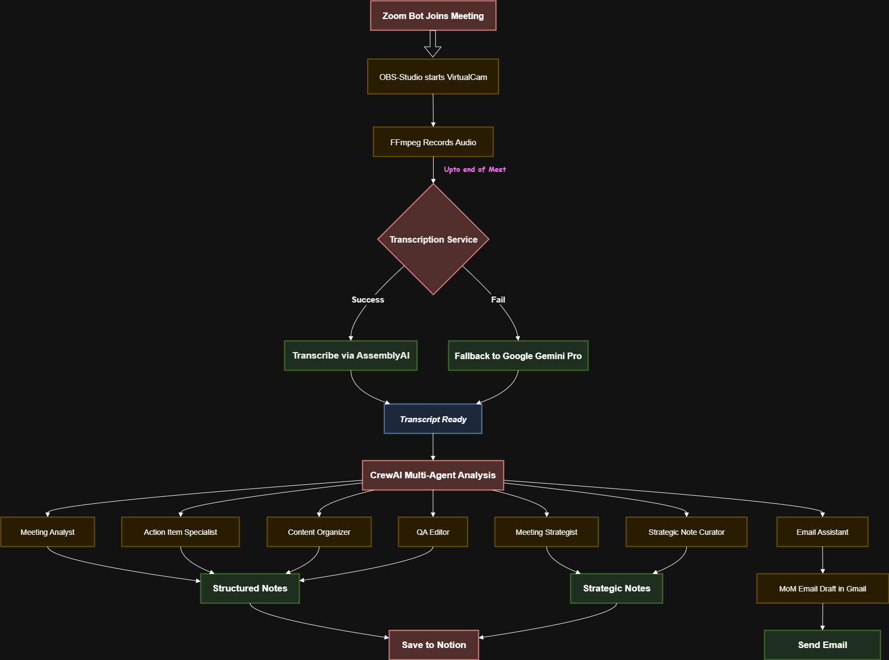
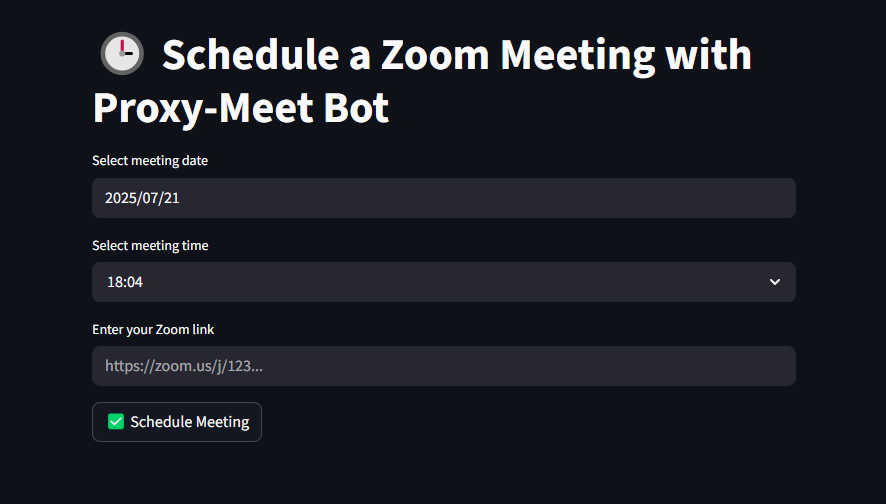
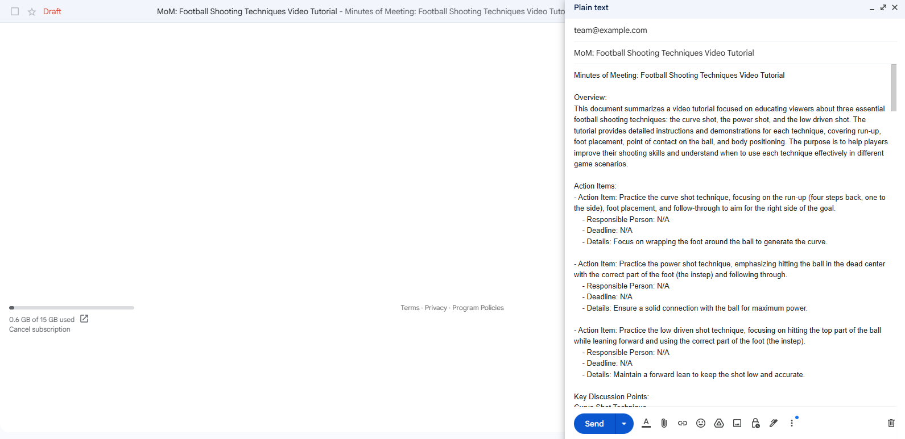
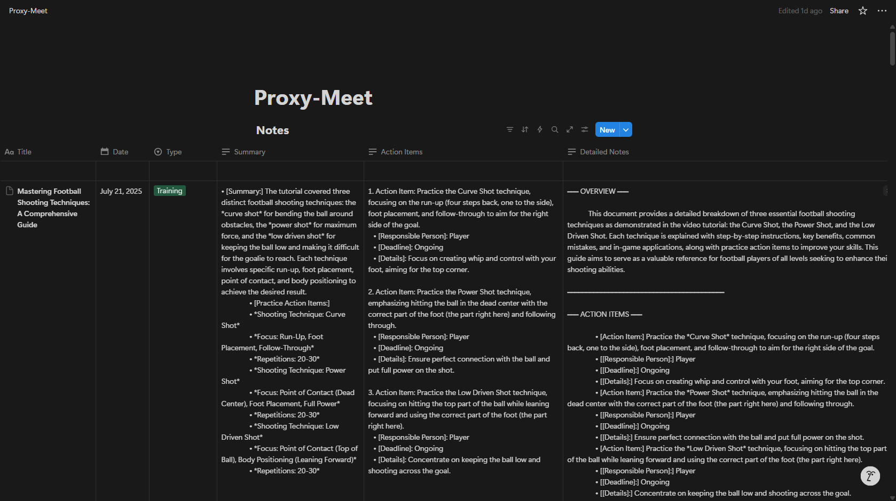

# Proxy-Meet: Intelligent Meeting Automation


> An intelligent meeting automation system that acts as your proxy in Zoom meetings — joining automatically, responding via voice and chat when your name is called, transcribing the full session with speaker diarization via Google Gemini 2.5 Pro, analysing the transcript through a seven-agent CrewAI pipeline, and delivering structured meeting notes to Notion and a Minutes of Meeting draft to Gmail.

---

## Table of Contents

- [Introduction](#introduction)
- [Architecture](#architecture)
- [Project Structure](#project-structure)
- [Prerequisites](#prerequisites)
- [Installation and Setup](#installation-and-setup)
  - [1. Clone the Repository](#1-clone-the-repository)
  - [2. Virtual Environment](#2-virtual-environment)
  - [3. Install Dependencies](#3-install-dependencies)
  - [4. Environment Configuration](#4-environment-configuration)
  - [5. Personal Avatar Setup](#5-personal-avatar-setup)
  - [6. OBS Studio Setup](#6-obs-studio-setup)
  - [7. FFmpeg and VB-CABLE Setup](#7-ffmpeg-and-vb-cable-setup)
  - [8. Notion Integration Setup](#8-notion-integration-setup)
  - [9. Google Gmail API Setup](#9-google-gmail-api-setup)
  - [10. API Keys Required](#10-api-keys-required)
  - [11. First Time Authentication](#11-first-time-authentication)
  - [12. Bot Configuration](#12-bot-configuration)
- [Getting Started](#getting-started)
- [What Happens After the Meeting](#what-happens-after-the-meeting)
- [Troubleshooting](#troubleshooting)
- [Security and Privacy](#security-and-privacy)

---

## Introduction

Proxy-Meet solves a simple but frustrating problem — when you cannot attend a meeting, you currently have no good option besides asking someone else to cover for you or missing it entirely. This project automates attendance entirely: a bot joins the Zoom meeting on your behalf using a pre-recorded video avatar streamed via OBS Studio, monitors the conversation for your name, and responds intelligently via voice and the in-meeting chat window.

Once the meeting ends, the system kicks off a full post-processing pipeline:

- **Transcription** — the recorded audio is transcribed with speaker diarization via Google Gemini 2.5 Pro and AssemblyAI, producing both a structured JSON and a human-readable `.txt` file
- **Multi-agent analysis** — a seven-agent CrewAI pipeline analyses the transcript, extracting themes, action items, key decisions, and structured notes in two formats (a predefined template and an AI-recommended format based on the meeting type)
- **Notion logging** — both sets of meeting notes are automatically pushed to a structured Notion database
- **Gmail draft** — a professional Minutes of Meeting email draft is created and waiting in Gmail, ready to send

The entire post-meeting workflow runs without any manual intervention.

---

## Architecture

<div align="center">
  
  <p><em>Proxy-Meet Architecture</em></p>
</div>

The application is built around a seven-agent CrewAI pipeline, where each agent has a single, clearly scoped responsibility:

| Agent | Role |
|---|---|
| Meeting Analyst | Extracts core content and themes from the transcript |
| Action Item Specialist | Identifies and structures all actionable tasks |
| Content Organizer | Arranges information into a logical hierarchy |
| Quality Assurance Editor | Verifies accuracy and enforces consistent formatting |
| Meeting Strategist | Determines the optimal documentation framework based on meeting type |
| Strategic Note Curator | Applies the chosen methodology to produce the second set of notes |
| Email Assistant | Formats and composes the Minutes of Meeting email draft |

**Why multi-agent instead of a single prompt?** Each agent specialises in one thing, produces a focused output, and passes it to the next. A single large prompt trying to do all of this at once loses coherence over long transcripts — chaining specialised agents maintains quality and makes each step auditable.

**Why OBS Studio for the avatar?** OBS acts as a virtual camera source, feeding the pre-recorded video into Zoom as if it were a live webcam feed. This means the bot appears as a real participant in the video grid rather than a faceless attendee.

**Why Selenium for Zoom automation?** Zoom's desktop client does not expose a public API for meeting control. Selenium drives the browser-based Zoom web client, handling the join flow, name entry, and in-meeting interactions programmatically.

---

## Project Structure

```
Proxy-Meet/
├── venv/                                    # Virtual environment (excluded from git)
├── archives/                                # Meeting records (excluded from git)
│   └── meeting_*/                           # One folder per meeting
│       ├── Meeting_Notes.md                 # Structured notes — predefined format
│       ├── Meeting_Notes2.md                # Structured notes — AI-recommended format
│       ├── recording.mp3                    # Full meeting audio recording
│       ├── recording_transcript_*.json      # Transcript with speaker diarization (JSON)
│       └── recording_transcript_*.txt       # Transcript with speaker diarization (readable)
├── pics/                                    # README and documentation images
├── credentials.json                         # Google OAuth credentials (excluded from git)
├── token.json                               # OAuth access token (excluded from git)
├── me.mp4                                   # Personal avatar video (excluded from git)
├── .env                                     # Environment variables (excluded from git)
├── requirements.txt                         # Python dependencies
├── zoom_bot.py                              # Zoom meeting automation — join, respond, record
├── agents.py                                # CrewAI agent definitions
├── meeting_pipeline.py                      # Core post-meeting processing pipeline
├── notion_logger.py                         # Pushes meeting notes to Notion
├── tools.py                                 # Utility functions for agents
├── utils.py                                 # General helper utilities
├── streamlit_app.py                         # Post-meeting review dashboard
├── meeting_scheduler.py                     # Streamlit scheduler interface
└── scheduler_runner.py                      # Automated scheduled execution
```

---

## Prerequisites

| Requirement | Purpose |
|---|---|
| Python 3.8+ | Runtime |
| OBS Studio | Virtual camera for avatar video |
| FFmpeg | Audio processing and recording |
| VB-CABLE | Virtual audio device for meeting capture |
| Google Cloud account | Gmail API and Gemini AI access |
| Google API key | Gemini 2.5 Pro transcription and analysis |
| AssemblyAI API key | Speech-to-text transcription |
| Notion account + API key | Meeting notes logging |
| Langfuse account | AI interaction monitoring (optional) |

---

## Installation and Setup

### 1. Clone the Repository

```bash
git clone https://github.com/YOUR_USERNAME/Proxy-Meet.git
cd Proxy-Meet
```

### 2. Virtual Environment

```bash
python -m venv venv
venv\Scripts\activate.bat
```

### 3. Install Dependencies

```bash
pip install -r requirements.txt
```

### 4. Environment Configuration

Create a `.env` file in the project root:

```env
# Notion
NOTION_API_KEY="your_notion_internal_integration_secret_key"
NOTION_DATABASE_ID="your_notion_database_id"

# Zoom
ZOOM_LINK="your_zoom_meeting_link"
WAIT_INTERVAL="30"
MAX_WAIT_TIME="3600"

# AI
GOOGLE_API_KEY=your_google_api_key
AAI_API_KEY=your_assemblyai_api_key
LANGFUSE_PUBLIC_KEY="your_langfuse_public_key"
LANGFUSE_SECRET_KEY="your_langfuse_secret_key"
LANGFUSE_HOST="https://cloud.langfuse.com"
```

### 5. Personal Avatar Setup

Record a short video of yourself (`me.mp4`) in good lighting and place it in the project root. This video is streamed via OBS as your virtual camera feed inside the Zoom meeting.

### 6. OBS Studio Setup

**Installation** — download from [obsproject.com](https://obsproject.com/) and install to `C:\Program Files\`.

**Scene configuration:**
1. Open OBS → right-click the Scenes panel → Add → name your scene → OK
2. Under Sources, click `+` → Media Source → Create New → OK
3. Browse to `me.mp4`, enable **Loop** and **Restart playback when source becomes active** → OK

OBS will now loop your video as a virtual camera source. Zoom will pick this up as a regular webcam feed.

### 7. FFmpeg and VB-CABLE Setup

**FFmpeg:**
1. Download from [ffmpeg.org](https://ffmpeg.org/download.html#build-windows) — choose "Built by BtBN" → `ffmpeg-master-latest-win64-gpl.zip`
2. Extract and copy contents to `C:\ffmpeg\` so the structure is:
```
C:\ffmpeg\
├── bin\
│   ├── ffmpeg.exe
│   ├── ffplay.exe
│   └── ffprobe.exe
└── doc\
```
3. Add `C:\ffmpeg\bin` to your System PATH (right-click This PC → Properties → Advanced system settings → Environment Variables → Path → New)
4. Restart your terminal and verify: `ffmpeg -version`

**VB-CABLE** — download the driver from [vb-audio.com](https://vb-audio.com/Cable/index.htm) and follow the on-page installation instructions. This creates a virtual audio device that captures meeting audio for recording.

### 8. Notion Integration Setup

**Create the integration:**
1. Go to [notion.so/my-integrations](https://www.notion.so/my-integrations) → New integration → name it → Submit
2. Copy the **Internal Integration Token** into `NOTION_API_KEY` in `.env`

**Create the database:**
1. In Notion, create a new page called `Meeting-Notes`
2. Add an inline database called `Notes` with these columns:

| Column | Type |
|---|---|
| Title | Title |
| Date | Date |
| Type | Select |
| Summary | Text |
| Action Items | Text |
| Detailed Notes | Text |
| Status | Select (add option: New) |
| Key Decisions | Text |

3. Open the database as a full page, copy the URL, and extract the 32-character database ID into `NOTION_DATABASE_ID` in `.env`
4. On the integration page → Access → grant Full Access to the `Meeting-Notes` page

### 9. Google Gmail API Setup

**Enable the API:**
1. Go to [Google Cloud Console](https://console.cloud.google.com/) → create or select a project
2. APIs & Services → Library → search Gmail API → Enable

**Create OAuth credentials:**
1. APIs & Services → Credentials → Create Credentials → OAuth client ID → Desktop application
2. Download the JSON, rename it to `credentials.json`, place it in the project root

**Configure consent screen:**
1. APIs & Services → OAuth consent screen → External
2. Fill in app name, support email, and developer contact
3. Add scope: `https://mail.google.com/`
4. Add your email as a test user

### 10. API Keys Required

| Key | Source | Used For |
|---|---|---|
| Google API key | [aistudio.google.com](https://aistudio.google.com/app/apikey) | Gemini 2.5 Pro transcription and analysis |
| AssemblyAI key | [assemblyai.com](https://www.assemblyai.com/) | Speech-to-text transcription |
| Langfuse keys | [langfuse.com](https://langfuse.com/) | AI interaction tracking and monitoring |

### 11. First Time Authentication

Run the bot once to trigger the Gmail OAuth flow:

```bash
python zoom_bot.py
```

You will be redirected to Google's OAuth consent screen. Sign in, grant permissions, and a `token.json` file will be created in the project root. Once the file appears, interrupt the run with `Ctrl+C` — authentication is complete and will not be needed again until the token expires.

### 12. Bot Configuration

Open `zoom_bot.py` and update the three personalisation settings:

```python
# Your name — used to detect when you are called in the meeting
BOT_NAME = "prasun"

# Message sent to chat when your name is detected
RESPONSE_TEXT = "Hi, this is Prasun's assistant. Prasun is ill today, his bot is attending the meet !!"

# Display name shown in the Zoom participants list
name_input.send_keys("Prasun-Bot")
```

---

## Getting Started

**Method 1 — Streamlit scheduler (recommended):**

```bash
streamlit run meeting_scheduler.py
```

Enter the meeting date, time, and Zoom link in the web interface. Proxy-Meet handles everything from that point.

<div align="center">
  
  <p><em>Meeting Scheduler Interface</em></p>
</div>

**Method 2 — Command line:**

Update `ZOOM_LINK` in `.env`, then run:

```bash
python zoom_bot.py
```

---

## What Happens After the Meeting

Once the meeting ends, the post-processing pipeline runs automatically with no manual steps required.

**Gmail** — a complete Minutes of Meeting draft is created in your Gmail inbox, addressed and ready to send:

<div align="center">
  
  <p><em>Automated Gmail MoM Draft</em></p>
</div>

**Notion** — both sets of structured meeting notes are pushed to your Notion database:

<div align="center">
  
  <p><em>Automated Notion Notes</em></p>
</div>

**Streamlit dashboard** — an interactive review interface opens automatically with the full audio recording, transcript, and organised notes:

<div align="center">
  
  <p><em>Meeting Analyzer Dashboard</em></p>
</div>

---

## Troubleshooting

### Zoom Join Failures

Chrome's popup sequence when joining a Zoom meeting can vary between sessions, which affects the automated join flow. If the bot fails to join, inspect the popup handling logic inside `join_zoom_and_record()` in `zoom_bot.py` and adjust the sequence to match your browser's current behaviour.

### Meeting End Not Detected

The bot detects meeting termination via the "meeting ended" signal. If the host simply leaves rather than formally ending the session, this signal is not sent and the bot will not terminate cleanly. Ensure meeting hosts use the **End Meeting for All** option.

### Transcription Failures

Transcription will fail or produce poor results if no audio was captured — this typically happens when VB-CABLE is not set as the active audio input, or if meeting audio levels were extremely low.

### Gmail Authentication Issues

If the Gmail OAuth flow breaks, delete `token.json` and re-run `zoom_bot.py` to re-authenticate. Ensure the Gmail API is enabled in your Google Cloud project and that your account is listed as a test user on the OAuth consent screen.

### General

- "File not found" errors — confirm `credentials.json` and `me.mp4` are in the project root
- API quota exceeded — check your Google API usage in the Cloud Console

---

## Security and Privacy

- Never commit `credentials.json`, `token.json`, or `.env` — all three are gitignored by default
- `me.mp4` stays local and is never uploaded to any external service
- All meeting recordings and transcripts are stored locally in `archives/`
- API keys are loaded exclusively from environment variables, never hardcoded
- All external API calls use HTTPS

---

*Built by Prasun*
